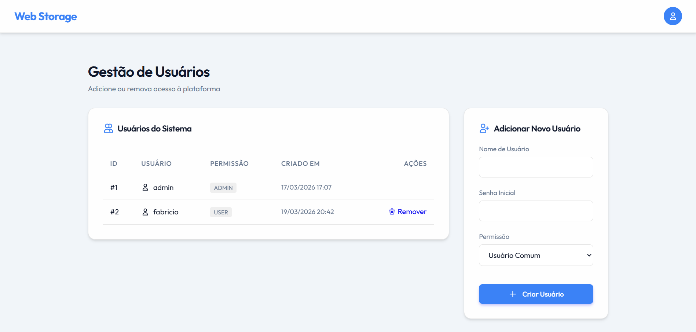
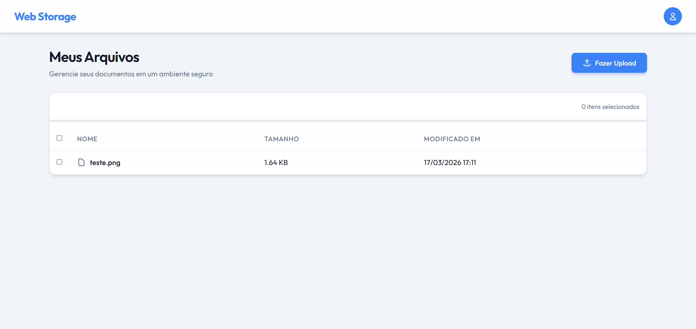

# 📁 Web Storage Platform

O **Web Storage** é uma plataforma moderna e segura de gerenciamento de arquivos em nuvem que proporciona aos usuários um ambiente privado para fazer upload, baixar, renomear, editar e excluir seus documentos e dados pessoais.

Este projeto foi desenhado sob o conceito de "Glassmorphism" e possui design dark/light mode amigável, providenciando interface moderna.

---

## 🚀 Tecnologias e Stack

O Web Storage foi construído utilizando as melhores e mais robustas opções do ecossistema Web Open-Source:

- **Back-end**: PHP 8.3 (FPM) rodando dentro de containers estruturados.
- **Servidor Web**: Nginx configurado com uploads expandidos (até 100MB por arquivo).
- **Banco de Dados**: PostgreSQL, mantendo forte integridade relacional.
- **Front-end**: HTML5 semântico, CSS3 Moderno (CSS Grid/Flexbox) e Javascript (Vanilla ES6+).
- **Testes Unitários**: PHPUnit.
- **Virtualização**: Docker + Docker Compose (para ambientes Dev / Prod).

### 🤖 Powered by Antigravity AI
Todo o desenvolvimento arquitetural inicial do projeto, refatoração de UI css/js para componentes apartados (modulares), separação dos limites do servidor de imagem do Docker e tratamentos de responsividade deste Web Storage foram orquestrados através do raciocínio avançado do agente assistente inteligente **Antigravity da Google Deepmind**, através da colaboração e pair-programming via instrução de comando reverso na CLI/Workspace.

---

## 🛠️ Passo a Passo Prático (Como Usar)

### Configuração Inicial (Variáveis de Ambiente)
Antes de tudo, garanta que o Docker e o `docker-compose` estejam instalados na sua máquina. Para proteger informações sensíveis, todas as credenciais do banco e configurações de ambiente foram extraídas dos arquivos do Docker e mapeadas externamente. 

Na raiz do projeto você encontrará um arquivo chamado `.env.model`. Copie-o (ou apenas renomeie-o) criando um novo arquivo estritamente chamado `.env`.
Dentro deste `.env`, você poderá personalizar livremente as senhas e nomes de banco de dados para os ambientes de Desenvolvimento (`docker-compose.yml`), Produção e Testes! Os containers do Docker lerão as variáveis automaticamente daqui.

### 1️⃣ Executando em Ambiente de Teste/Desenvolvimento
Para inciar a aplicação via Docker Compose na porta 80 do seu localhost, execute:
```bash
docker compose -f docker-compose.yml up --build -d
```

### 2️⃣ Executando as Migrations (Esquema no Banco de Dados)
Sempre que ligar o container pela primeira vez, as tabelas estarão vazias. Você precisa executar o script de inicialização do banco de dados interativamente:
```bash
docker compose -f docker-compose.yml exec app php src/init_db.php
```
> **Credenciais Padrão e Segurança**: Ao iniciar, um administrador de sistema será gerado. O login inicial é:
> - **Usuário**: `admin`
> - **Senha**: `admin`
> 
> *Atenção:* O sistema identificará o seu primeiro acesso e exigirá uma troca imediata de senha por medidas de proteção, te isolando em uma tela de segurança até que o faça.

### 3️⃣ Testes Automatizados (PHPUnit) e Scripts Úteis (.sh)
No diretório raiz do projeto, disponibilizamos dois scripts auxiliares BASH para manutenção rápida:

1. **Testes (`run-tests.sh`)**: Script completo que constrói os containers isolados de teste (`docker-compose.test.yml`), aguarda o banco limpar, instala as dependências via Composer e executa toda a malha de testes unitários do PHPUnit sem interferir no banco de dados local da aplicação principal. Execute via terminal:
   ```bash
   ./run-tests.sh
   ```

2. **Permissões (`set_permissions.sh`)**: Script útil para ambientes Unix. Ele garante e reconecta que as pastas primárias como `storage/` possuem a capacidade nativa de Leitura e Gravação (chmod 777), caso ocorra problemas do Nginx ou FPM recusar acesso aos discos por políticas do S.O hospedeiro:
   ```bash
   ./set_permissions.sh
   ```

### 4️⃣ Deploy para Produção Limitada 
Você notará que existe um construtor otimizado exclusivo chamado `Dockerfile.prod`, além de configurações focadas no opcache. Para forçar um deploy fechado em ambiente de produção (mais veloz), monte usando:
```bash
docker compose -f docker-compose.prod.yml up --build -d
```

---

## 🖼️ Telas e Imagens de Demonstração

*(Abaixo deixamos como sugestão as capturas de tela das principais rotas para guiar visualmente novos utilizadores)*

### Painel Admin (Dashboard e Gerenciamento)

No lado esquerdo os administradores têm o controle total em formato de tabela (Listagem); no direito têm campos livres para a adição instantânea de novos membros ao grupo local.

### Dashboard (Arquivos Web Storage)

Um design flex com botões minimalistas; suporte à seleções massivas ou isoladas; capacidade de abrir, ver e renomear arquivos nativos sem recarregar o page state todo.
